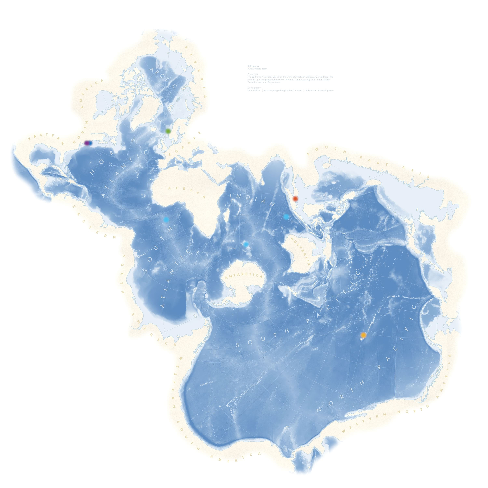

The channels contained in this library come from various experiments. The experiments differ by geographical location, transmission distance, water depth, transmitter/receiver mobility, acoustic bandwidth and the size of the recording array. The channels are color-labeled, and a detailed description of relevant parameters is given below for each. To download the channels, click [here](https://www.dropbox.com/scl/fo/3gyt4cgw47jfx716v0epd/AIqYaL5S2RxGylREu3sn-vY?rlkey=w2mvoklkm42zrrf6k6lwlzcxu&st=u3u6b5r9&dl=0).

Each channel is estimated from the experimental data and stored in a matrix ${\bf C}$ of complex-baseband impulse responses evolving over time. If a recording array is available, there is one such matrix for each array element. Each row of this matrix represents an instantaneous channel response as a function of delay. Different rows correspond to different, equi-spaced instants in time. Any motion-induced delay drifting is suppressed in the channel matrix to enable compression for efficient storage. A separate vector $\theta$ is provided which contains the uncompressed time-varying channel phase that is directly related to the delay. To fully reconstruct the channel, the matrix ${\bf C}$ needs to be uncompressed, and the phase/delay needs to be imparted to re-introduce phase shifting and delay drifting. Details of this process, along with the ready-to-use code, are given in the [User’s Guide](/docs).

|        | Location           | Date      | Center Frequency [kHz] | Symbol Rate [kHz] | Distance [km] | Tx/Rx/water depth [m] | Mobility             | Array Configuration     | Number of Elements | Element Spacing [cm] |
|--------|--------------------|-----------|------------------------|-------------------|---------------|-----------------------|----------------------|-------------------------|--------------------|----------------------|
| Blue   | North Atlantic     | Jun. 2010 | 13                     | 10^7/2048         | 3-7           | 30-60/50/100          | Mobile, up to 1.5m/s | Vertical                | 12                 | 12                   |
| Purple | North Atlantic     | Oct. 2008 | 12.5                   | 6.5               | 0.06          | 11/10/15              | Moored               | Cross/Vertical/Vertical | 32/16/12           | 5/5/12               |
| Yellow | Hawaii             | Jun. 2011 | 13                     | 6.25              | 3/7           | 50/50/100             | Moored               | Vertical/Vertical       | 24/24              | 5/20                 |
| Green  | Norway, West Coast | Nov. 2024 | 6/11.52/28             | 4.5/5.625/9       | 0.27          | 20/43/60              | Moored               | N/A                     | N/A                | N/A                  |
| Red    | Singapore          | Nov. 2024 | 25                     | 9.6               | 0.1           | 6/3/8                 | Drifting             | Vertical                | 3                  | 0.8                  |

