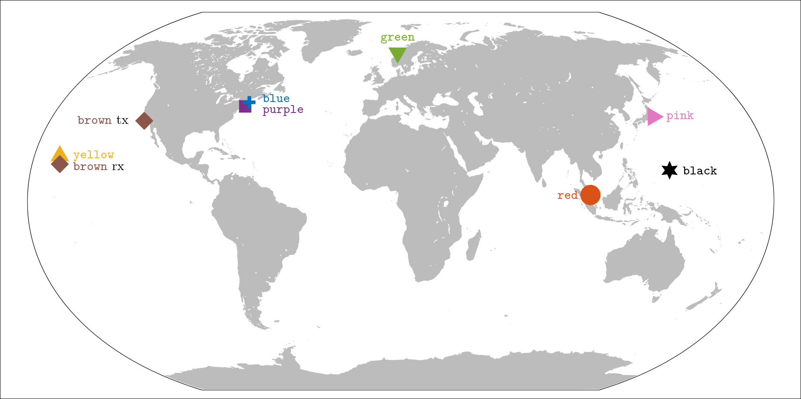

The channels contained in this library come from various experiments. The experiments differ by geographical location, transmission distance, water depth, transmitter/receiver mobility, acoustic bandwidth and the size of the recording array. The channels are color-labeled, and a detailed description of relevant parameters is given below for each. To download the channels, click [here](https://www.dropbox.com/scl/fo/3gyt4cgw47jfx716v0epd/AIqYaL5S2RxGylREu3sn-vY?rlkey=w2mvoklkm42zrrf6k6lwlzcxu&st=u3u6b5r9&dl=0).

Each channel is estimated from the experimental data and stored in a matrix ${\bf C}$ of complex-baseband impulse responses evolving over time. If a recording array is available, there is one such matrix for each array element. Each row of this matrix represents an instantaneous channel response as a function of delay. Different rows correspond to different, equi-spaced instants in time. Any motion-induced delay drifting is suppressed in the channel matrix to enable compression for efficient storage. A separate vector $\theta$ is provided which contains the uncompressed time-varying channel phase that is directly related to the delay. To fully reconstruct the channel, the matrix ${\bf C}$ needs to be uncompressed, and the phase/delay needs to be imparted to re-introduce phase shifting and delay drifting. Details of this process, along with the ready-to-use code, are given in the [User’s Guide](/docs).

<table><thead>
  <tr>
    <th></th>
    <th>Location</th>
    <th>Date</th>
    <th>$d_{T}$/$d_{R}$/$d_{w}$ [m]</th>
    <th>Mobility</th>
    <th>$d$ [km]</th>
    <th>$f_c$ [kHz]</th>
    <th>$R$ [ksym/s]</th>
    <th>Array</th>
    <th>$M$</th>
    <th>$\ell$ [m]</th>
  </tr></thead>
<tbody>
  <tr>
    <td><a href="blue" style="color: #0072BD">Blue</a></td>
    <td>North Atlantic</td>
    <td>Jun. 2010</td>
    <td>30-60/50/100</td>
    <td>Mobile</td>
    <td>3-7</td>
    <td>13</td>
    <td>$10^4/2048$</td>
    <td>Vertical</td>
    <td>12</td>
    <td>0.12</td>
  </tr>
  <tr>
    <td><a href="red" style="color: #D95319">Red</a></td>
    <td>Singapore</td>
    <td>Nov. 2024</td>
    <td>6/3/8-15</td>
    <td>Drifting</td>
    <td>0.1-0.25</td>
    <td>25</td>
    <td>9.6</td>
    <td>Vertical</td>
    <td>3</td>
    <td>0.8</td>
  </tr>
  <tr>
    <td rowspan="4"><a href="yellow" style="color: #EDB120">Yellow</a></td>
    <td rowspan="4">Hawaii</td>
    <td rowspan="4">Jun. 2011</td>
    <td rowspan="2">50/50/100</td>
    <td rowspan="4">Moored</td>
    <td>3</td>
    <td rowspan="4">13</td>
    <td rowspan="4">6.25</td>
    <td rowspan="4">Vertical</td>
    <td>24</td>
    <td>0.05</td>
  </tr>
  <tr>
    <td>7</td>
    <td>24</td>
    <td>0.2</td>
  </tr>
  <tr>
    <td rowspan="2">50/8.7-65/100</td>
    <td>3</td>
    <td>16</td>
    <td>3.75</td>
  </tr>
  <tr>
    <td>7</td>
    <td>16</td>
    <td>3.75</td>
  </tr>
  <tr>
    <td rowspan="3"><a href="purple" style="color: #7E2F8E">Purple</a></td>
    <td rowspan="3">North Atlantic</td>
    <td rowspan="3">Oct. 2008</td>
    <td rowspan="3">11/10/15</td>
    <td rowspan="3">Moored</td>
    <td>0.06</td>
    <td rowspan="3">12.5</td>
    <td rowspan="3">$10^4/1536$</td>
    <td>Cross</td>
    <td>32</td>
    <td>0.0375</td>
  </tr>
  <tr>
    <td>0.2</td>
    <td>Vertical</td>
    <td>24</td>
    <td>0.05</td>
  </tr>
  <tr>
    <td>1</td>
    <td>Vertical</td>
    <td>12</td>
    <td>0.12</td>
  </tr>
  <tr>
    <td><a href="green" style="color: #77AC30">Green</a></td>
    <td>Norway</td>
    <td>Nov. 2024</td>
    <td>20/43/60</td>
    <td>Moored</td>
    <td>0.27</td>
    <td>6</td>
    <td>4.5</td>
    <td>Time</td>
    <td>64</td>
    <td>10 min</td>
  </tr>
  <tr>
    <td><a href="black" style="color: #000000">Black</a></td>
    <td>Mariana Trench</td>
    <td>Oct. 2024</td>
    <td>6/8718/8720</td>
    <td>Moored</td>
    <td>8.72</td>
    <td>18</td>
    <td>12.5</td>
    <td>Circular</td>
    <td>8</td>
    <td>x</td>
  </tr>
  <tr>
    <td><a href="pink" style="color: #E377C2">Pink</a></td>
    <td>Japan</td>
    <td>Jul. 2022</td>
    <td>176/146/x</td>
    <td>Moored</td>
    <td>14</td>
    <td>6</td>
    <td>4</td>
    <td>Vertical</td>
    <td>24</td>
    <td>x</td>
  </tr>
  <tr>
    <td><a href="brown" style="color: #8C564B">Brown</a></td>
    <td>Pacific</td>
    <td>Nov. 1994</td>
    <td>652/900-1600/x</td>
    <td>Mobile</td>
    <td>3250</td>
    <td>0.075</td>
    <td>0.0375</td>
    <td>Vertical</td>
    <td>20</td>
    <td>35</td>
  </tr>
</tbody></table>

For the <a href="green" style="color: #77AC30">Green</a> channel, $M$ denotes the number of time-diversity channels formed from repeated transmissions on a single hydrophone, and $\ell$ denotes the inter-transmission interval.

