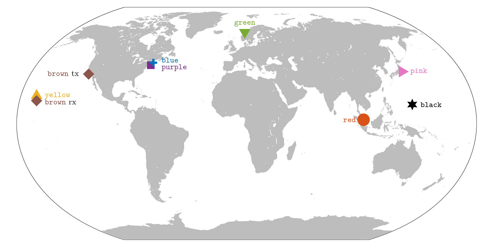

The channels contained in this library come from various experiments. The experiments differ by geographical location, transmission distance, water depth, transmitter/receiver mobility, acoustic bandwidth, and the size of the recording array. The channels are color-labeled, and a detailed description of relevant parameters is given below for each. The channels are available for download from Zenodo:

 ([https://doi.org/10.5281/zenodo.21287414](https://doi.org/10.5281/zenodo.21287414))

Each channel is estimated from the experimental data and stored as a tensor of complex-baseband impulse responses evolving over time, with dimensions [delay, receiver, time]. If a recording array is available, the tensor holds one matrix for each array element. Each column of this matrix is an instantaneous channel response as a function of delay, that is, the channel vector $\hat{\underline{\mathbf{h}}}[n]$ at time index $n$. Successive columns correspond to different, equi-spaced instants in time. Any motion-induced delay drift is suppressed in the channel matrix, leaving the drift-free response $\hat{\underline{h}}(\tau, t)$, which compresses efficiently for storage. A separate vector, the phase estimate $\hat{\varphi}(nT_s)$ stored as `phi_hat`, is provided that contains the uncompressed time-varying channel phase, which is directly related to the delay drift. Here $T_s$ is the sampling interval along the delay axis. To fully reconstruct the channel, the stored matrix needs to be decompressed, and the phase/delay needs to be imparted to re-introduce the phase shift and the delay drift. Details of this process, along with the ready-to-use code, are given in the [User's Guide](/docs). The stored variable names, and the alternative convention in which only the phase $\hat{\theta}(nT_s)$ is tracked (`theta_hat`) and the delay drift is left in the taps, are documented in the [channel file format specifications](/docs/file_specifications).

<table><thead>
  <tr>
    <th>Codename</th>
    <th>Location</th>
    <th>Date</th>
    <th>dT/dR/dw [m]</th>
    <th>Mobility</th>
    <th>d [km]</th>
    <th>fc [kHz]</th>
    <th>R [ksym/s]</th>
    <th>Array</th>
    <th>M</th>
    <th>&#8467; [m]</th>
  </tr></thead>
<tbody>
  <tr>
    <td><a href="blue" style="color: #0072BD">Blue</a></td>
    <td>North Atlantic</td>
    <td>Jun. 2010</td>
    <td>30-60/50/100</td>
    <td>Mobile</td>
    <td>3-7</td>
    <td>13</td>
    <td>104/2048</td>
    <td>Vertical</td>
    <td>12</td>
    <td>0.12</td>
  </tr>
  <tr>
    <td><a href="red" style="color: #D95319">Red</a></td>
    <td>Singapore</td>
    <td>Nov. 2024</td>
    <td>6/4.6/8-20</td>
    <td>Drifting</td>
    <td>0.1-0.4</td>
    <td>25</td>
    <td>9.6</td>
    <td>Vertical</td>
    <td>3</td>
    <td>0.8</td>
  </tr>
  <tr>
    <td rowspan="4"><a href="yellow" style="color: #EDB120">Yellow</a></td>
    <td rowspan="4">Hawaii</td>
    <td rowspan="4">Jul. 2011</td>
    <td rowspan="2">50/50/100</td>
    <td rowspan="4">Moored</td>
    <td>3</td>
    <td rowspan="4">13</td>
    <td rowspan="4">6.25</td>
    <td rowspan="4">Vertical</td>
    <td>24</td>
    <td>0.05</td>
  </tr>
  <tr>
    <td>7</td>
    <td>24</td>
    <td>0.2</td>
  </tr>
  <tr>
    <td rowspan="2">50/8.6-65/100</td>
    <td>3</td>
    <td>16</td>
    <td>3.75</td>
  </tr>
  <tr>
    <td>7</td>
    <td>16</td>
    <td>3.75</td>
  </tr>
  <tr>
    <td rowspan="3"><a href="purple" style="color: #7E2F8E">Purple</a></td>
    <td rowspan="3">North Atlantic</td>
    <td rowspan="3">Oct. 2008</td>
    <td rowspan="3">11/10/15</td>
    <td rowspan="3">Moored</td>
    <td>0.06</td>
    <td rowspan="3">12.5</td>
    <td rowspan="3">104/1536</td>
    <td>Cross</td>
    <td>32</td>
    <td>0.0375</td>
  </tr>
  <tr>
    <td>0.2</td>
    <td>Vertical</td>
    <td>24</td>
    <td>0.05</td>
  </tr>
  <tr>
    <td>1</td>
    <td>Vertical</td>
    <td>12</td>
    <td>0.12</td>
  </tr>
  <tr>
    <td><a href="green" style="color: #77AC30">Green</a></td>
    <td>Norway</td>
    <td>Nov. 2024</td>
    <td>20/43/60</td>
    <td>Moored</td>
    <td>0.27</td>
    <td>6</td>
    <td>4.5</td>
    <td>Time</td>
    <td>64</td>
    <td>10 min</td>
  </tr>
  <tr>
    <td><a href="black" style="color: #000000">Black</a></td>
    <td>Mariana Trench</td>
    <td>Oct. 2024</td>
    <td>8718/6/8720</td>
    <td>Moored</td>
    <td>8.72</td>
    <td>18</td>
    <td>12.5</td>
    <td>Planar</td>
    <td>8</td>
    <td>&ge; 0.088</td>
  </tr>
  <tr>
    <td><a href="pink" style="color: #E377C2">Pink</a></td>
    <td>Japan</td>
    <td>Jul. 2022</td>
    <td>176/146/x</td>
    <td>Moored</td>
    <td>14</td>
    <td>6</td>
    <td>4</td>
    <td>Vertical</td>
    <td>24</td>
    <td>0.9-1.8</td>
  </tr>
  <tr>
    <td><a href="brown" style="color: #8C564B">Brown</a></td>
    <td>Pacific</td>
    <td>Nov. 1994</td>
    <td>652/900-1600/4000, 5300</td>
    <td>Mobile</td>
    <td>3250</td>
    <td>0.075</td>
    <td>0.0375</td>
    <td>Vertical</td>
    <td>20</td>
    <td>35</td>
  </tr>
</tbody></table>

Column key: dT, dR, and dw are the transmitter depth, the receiver depth, and the water depth; d is the transmitter-receiver distance; fc is the center frequency; R is the symbol rate of the transmitted probe signal; M is the number of array elements; &#8467; is the inter-element spacing. Where two values are listed for dw, they are the water depths at the transmitter and at the receiver. An "x" marks a value that was not recorded.

For the <a href="green" style="color: #77AC30">Green</a> channel, M denotes the number of time-diversity channels formed from repeated transmissions on a single hydrophone, and &#8467; denotes the inter-transmission interval.

